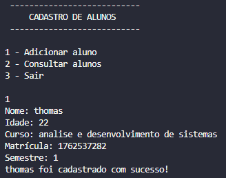

## Cadastro de Alunos em Java 🎓

# Sobre o projeto: 
Desenvolvi este projeto com o objetivo de praticar os conceitos de Programação Orientada a Objetos (POO) em Java, implementando um sistema simples de cadastro de alunos.

# Tecnologias utilizadas 🛠️
Java
Visual Studio Code

# Funcionalidades ⚙️
Cadastro de novos alunos
Consulta de alunos cadastrados
Armazenamento dos alunos utilizando ArrayList
Menu interativo no terminal
Organização do código utilizando Programação Orientada a Objetos (POO)

# Demonstração 📷
